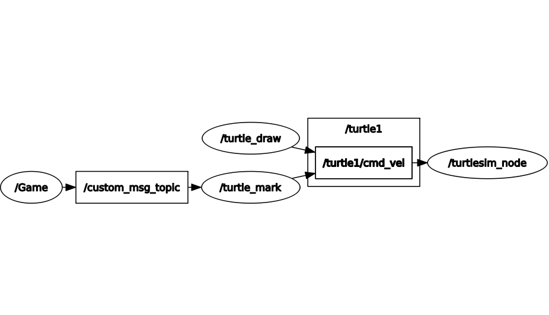

# ROS_Tic-Tac-Toe

This repository hosts the code for the ROS <project1_pkg> package which implements the Tic-Tace-Toe game for the Robot Operating System (ROS 1 Melodic) 
using turtlesim 

# Usage

To use the project1_pkg package clone this repository into the src folder of your catkin workspace.

Then build the workspace with catkin_make.

Finally start the package using roslaunch command: roslaunch project1_pkg tic_tac_toe.launch

# ROS Node Graph

# Node Descriptions

## /turtle_draw

* This node prepares the game board by creating a grid pattern on the turtlesim screen

## /Game

* This node takes input positions from the players and publishes them, along with the symbol, to another node called "/turtle_mark"

## /turtle_mark

* This node, which subscribes to the "/Game" node, computes the received message and draws the appropriate at the desired location on the game board
